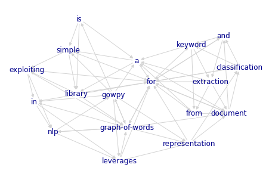

# gowpy

[](https://badge.fury.io/py/gowpy)
[](https://github.com/GuillaumeDD/gowpy/actions)
[](https://github.com/GuillaumeDD/gowpy/blob/master/LICENSE)

A very simple library for exploiting graph-of-words in NLP. 
Currently at version **0.2.0**.

The graph-of-words model has been shown to be an interesting alternative
to the widespread bag-of-words model by challenging its term independence 
assumption [[1,2]](#references).
In particular, the graph-of-words model makes it possible to capture term 
dependence and term order.
If you are looking for an efficient alternative to TF-IDF, give graph-of-words 
a try on your dataset!

gowpy leverages graph-of-words representation in order to do:
- [**document classification**](#classification-with-tw-idf-a-graph-based-term-weighting-score)
  in a [scikit-learn](https://scikit-learn.org)-like way via useful vectorizers, and
- unsupervised [**keyword extraction**](#unsupervised-keywords-extraction) from a 
  single document. 

Detailed explanations, evaluations and discussions can be found in 
the [reference section](#references).

## Quick Start
### Requirements and Installation
This project is based on Python 3.6+, [scikit-learn](https://github.com/scikit-learn/scikit-learn) and 
[NetworkX](https://github.com/networkx/networkx). 

#### Installation from PyPI
```bash
pip install gowpy
```

#### Installation from the GitHub Source
First, clone the project:
```bash
git clone https://github.com/GuillaumeDD/gowpy.git
```

Then, `cd` to the project folder and run the install command:
```bash
cd gowpy/
python setup.py install
```

### Example Usage
#### Example Notebooks
See the [examples/ directory](./examples/) for example of notebooks:
- [Notebook 1: unsupervised keyword extraction](./examples/keyword_extraction-paper_example.ipynb)
- [Notebook 2: multi-class classification with TW-IDF](./examples/classification-r8-twidf.ipynb)
- [Notebook 3: multi-class classification with frequent subgraphs](./examples/classification-r8-frequent_subgraphs.ipynb)

#### Building a Graph-of-Words from a Document

```python
from gowpy.gow.builder import GoWBuilder

# Creation of a graph-of-words builder
# Here:
# - the graph-of-words will be directed, and
# - an edge will link every tokens co-occurring in a sliding window of size 4
#
builder = GoWBuilder(directed=True, window_size=4)

text = """gowpy is a simple library for exploiting graph-of-words in nlp gowpy 
leverages graph-of-words representation for document classification and for keyword extraction 
from a document"""

# Here, a preprocessing step fitted to the need of the project should be carried out 

# Creation of the graph-of-words
gow = builder.compute_gow_from_document(text)
```

Then, it is possible to visualize the document as a graph-of-words:
```python
import matplotlib.pyplot as plt
import networkx as nx

g = gow.to_labeled_graph()

options = {
    "font_weight" : 'normal',
    "font_color" : 'darkblue',
    #
    "edge_color" : 'lightgray',
    #
    "node_size" : 200,
    "node_color": 'white',
    "with_labels": True,
}
nx.draw(g, **options)
``` 



#### Unsupervised Keywords Extraction
Graph-of-words can be leveraged to extract an automatically adaptative number of
cohesive keywords from a text document in an unsupervised fashion [[2,3]](#references).

gowpy implements the graph-of-words methods presented in [[3]](#references):
- the three batch keyword extraction methods based on k-core, and
- the word-level keyword extraction method CoreRank.

See this [example notebook](./examples/keyword_extraction-paper_example.ipynb)
that repoduces the running example of the paper demonstrating all the methods.

For short and medium size documents, both the "density" and the "inflexion" methods
have been showing strong performance. Here is how you can use the "density" method: 
```python
from gowpy.summarization.unsupervised import KcoreKeywordExtractor

extractor_kw = KcoreKeywordExtractor(directed=False, weighted=True, window_size=4,
                                     selection_method='density')

# 
# Note that preprocessing is particularly important for keyword extraction
# in order to keep and normalize important terms such as adjectives and nouns.
#
# An already preprocessed text in which to extract keywords

preprocessed_text = """gowpy simple library exploiting graph-of-words nlp gowpy 
leverages graph-of-words representation document classification keyword extraction 
document"""

extractor_kw.extract(preprocessed_text)
```

Returns:
```text
[('gowpy', 4),
 ('simple', 4),
 ('library', 4),
 ('exploiting', 4),
 ('graph-of-words', 4),
 ('nlp', 4),
 ('leverages', 4),
 ('representation', 4),
 ('document', 4),
 ('classification', 4),
 ('keyword', 4),
 ('extraction', 4)]
```

For longer documents, the CoreRank method has been shown to be more appropriate.
This method takes an optional parameter that can specify the number of keywords
to extract:
```python
from gowpy.summarization.unsupervised import CoreRankKeywordExtractor

extractor_kw_cr = CoreRankKeywordExtractor(directed=False, weighted=True, window_size=4)

preprocessed_text = """gowpy simple library exploiting graph-of-words nlp gowpy 
leverages graph-of-words representation document classification keyword extraction 
document"""

extractor_kw_cr.extract(preprocessed_text, n=5)
```

Returns:
```text
[('graph-of-words', 36),
 ('gowpy', 28),
 ('representation', 24),
 ('document', 24),
 ('library', 20)]
```

#### Classification with TW-IDF: a graph-based term weighting score
TW-IDF [[0]](#references) challenges the term independence assumption behind 
the bag-of-words model by (i) exploiting a graph-of-words representation of a 
document (here an unweighted directed graph of terms), and by (ii) leveraging 
this new representation to replace the term frequency (TF) by graph-based term 
weights (TW).  

See this [example notebook](./examples/classification-r8-twidf.ipynb) for a 
usage example of TW-IDF for a multi-class classification task.

TW-IDF is accessible via a dedicated vectorizer:
```python
from gowpy.feature_extraction.gow import TwidfVectorizer

corpus = [
    'hello world !',
    'foo bar'
]

vectorizer_gow = TwidfVectorizer(                 
    # Graph-of-words specificities
    directed=True,
    window_size=4,
    # Token frequency filtering
    min_df=0.0,
    max_df=1.0,
    # Graph-based term weighting approach
    term_weighting='degree'
)

X = vectorizer_gow.fit_transform(corpus)
X
```
Returns:
```text
<2x5 sparse matrix of type '<class 'numpy.float64'>'
	with 3 stored elements in Compressed Sparse Row format>
```

TW-IDF vectorizer fits seamlessly in a grid search:
```python
from sklearn.pipeline import Pipeline
from sklearn.svm import SVC

from sklearn.model_selection import GridSearchCV

pipeline = Pipeline([
    ('gow', TwidfVectorizer()),
    ('svm', SVC()),
])

parameters = {
    'gow__directed' : [True, False],
    'gow__window_size' : [2, 4, 8, 16],
    'gow__b' : [0.0, 0.003],
    'gow__term_weighting' : ['degree', 'pagerank'],
    'gow__min_df' : [0, 5, 10],
    'gow__max_df' : [0.8, 0.9, 1.0],
#
    'svm__C' : [0.1, 1, 10],
    'svm__kernel' : ['linear']
}

# find the best parameters for both the feature extraction and the
# classifier
grid_search = GridSearchCV(pipeline, 
                           parameters, 
                           cv=10,
                           n_jobs=-1)
```

#### Going further: classification based on frequent subgraphs
Frequent subgraphs corresponding to long range n-gram can be mined and 
subsequently used for document classification [[1]](#references).
 
Classification with frequent subgraphs happens in a 3-step process:
1. Conversion of the corpus of already preprocessed documents into a collection
  of graph-of-words
1. Mining the frequent subgraphs
1. Loading the frequent subgraphs and exploiting them for classification

See this [example notebook](./examples/classification-r8-frequent_subgraphs.ipynb)
for a usage example of frequent subgraphs for a multi-class classification task.

##### Conversion of the corpus into a collection of graph-of-words
The first step consists in turning the corpus into a graph-of-words and collection
and then export that collection into a file format suited for frequent subgraph
mining.
```python
from gowpy.gow.miner import GoWMiner
import gowpy.gow.io

corpus = [
    'hello world !',
    'foo bar',
    # and many more...
]

# Conversation of the corpus into a collection of graph-of-words
gow_miner = GoWMiner(directed=False, window_size=4)
corpus_gows = gow_miner.compute_gow_from_corpus(corpus)

# Exportation of the collection of graph-of-words into a file for
# interoperability with other languages such as C++
with open("corpus_gows.data", "w") as f_output:
    data = gowpy.gow.io.gow_to_data(corpus_gows)
    f_output.write(data)
```

##### Mining the frequent subgraphs
Frequent subgraphs mining can be realized via the [gSpan algorithm](https://www.cs.ucsb.edu/~xyan/software/gSpan.htm).
This step is not included in this project and has to be carried out by another
program.

This project supports the reimplementation from [gBolt available at GitHub](https://github.com/Jokeren/gBolt).
Currently this implementation is limited to **undirected graph**.
To mine frequent subgraphs (after having installed gBolt on your machine):
```bash
OMP_NUM_THREADS=1 ./gbolt --input corpus_gows.data --output gbolt-mining-corpus_gow --dfs --nodes --support 0.01
```
Notice the **support parameter** which defines the minimum frequency of a subgraph
to be considered as frequent. Here it is set to 1% (0.01).
This parameter is **corpus specific** and should be carefully tuned (see [[1]](#references)).

Mining produces two files:
- `gbolt-mining-corpus_gow.t0`: the frequent subgraphs with more than one node
- `gbolt-mining-corpus_gow.nodes`: the frequent single nodes

These two files can be loaded by the same `gow_miner` used for exportation:
```python
gow_miner.load_graphs('gbolt-mining-corpus_gow.t0', 
                      'gbolt-mining-corpus_gow.nodes')
gow_miner
```
Returns:
```text
Graph-of-word miner:
        - is_directed: False
        - window_size: 4
        - edge_labeling: True

        - Number of tokens: 5
        - Number of links between tokens: 4

        - Number of loaded subgraph: 13
```

##### Classification with frequent subgraphs
Classification with frequent subgraphs is accessible via a dedicated vectorizer:
```python
from gowpy.feature_extraction.gow import GoWVectorizer

vectorizer_gow = GoWVectorizer(gow_miner)
X = vectorizer_gow.fit_transform(corpus)
# X is a sparse matrix
```

Before tuning the `min_df` (the minimum being the support chosen during mining)
and the `max_df`, it is possible the have a look at the normalized frequency
distribution:
```python
import pandas as pd
s_freq_per_pattern = pd.Series(gow_miner.stat_relative_freq_per_pattern())
s_freq_per_pattern.describe()
```
For instance, it can returns the following distribution:
```text
count    10369.000000
mean         0.026639
std          0.046551
min          0.008333
25%          0.010000
50%          0.013333
75%          0.022778
max          0.865000
dtype: float64
```


GoW vectorizer fits nicely in a grid search:
```python
from sklearn.pipeline import Pipeline
from sklearn.svm import SVC
from sklearn.feature_extraction.text import TfidfTransformer

from sklearn.model_selection import GridSearchCV

pipeline = Pipeline([
    ('gow', GoWVectorizer(gow_miner)),
    ('tfidf', TfidfTransformer()),
    ('svm', SVC()),
])

parameters = {
    'gow__subgraph_matching' : ['partial', 'induced'],
    'gow__min_df' : [0.00833, 0.01, 0.013333],
    'gow__max_df' : [0.022778, 0.5, 0.865],
#
    'svm__C' : [0.1, 1, 10],
    'svm__kernel' : ['linear']
}

# find the best parameters for both the feature extraction and the
# classifier
grid_search = GridSearchCV(pipeline, 
                           parameters, 
                           cv=10,
                           n_jobs=-1)
```

## References

Detailed explanations, evaluations and discussions can be found in these papers:
- Information retrieval (TW-IDF)
   + [0] [Graph-of-word and TW-IDF: New Approach to Ad Hoc IR](https://dl.acm.org/doi/abs/10.1145/2505515.2505671).
     *Rousseau, François, and Vazirgiannis, Michalis*.
     *Proceedings of the 22nd ACM international conference on Information & Knowledge Management*.(**CIKM 2013**)
- Document classification with frequent subgraphs
   + [1] [Text Categorization as a Graph Classification Problem](http://www.aclweb.org/anthology/P15-1164).
      *Rousseau, François, Kiagias, Emmanouil and Vazirgiannis, Michalis*.
      *Proceedings of the 53rd Annual Meeting of the Association for Computational Linguistics and the 7th International 
      Joint Conference on Natural Language Processing* (**ACL 2015**)
- Keyword extraction from graph-of-words
   + [2] [Main Core Retention on Graph-of-words for Single-Document Keyword Extraction](https://link.springer.com/chapter/10.1007/978-3-319-16354-3_42).
     *Rousseau, François, and Vazirgiannis, Michalis*.
     *Proceedings of the 37th European Conference on Information Retrieval*.
     (**ECIR 2015**)
   + [3] [A Graph Degeneracy-based Approach to Keyword Extraction](https://www.aclweb.org/anthology/D16-1191/).
     *Tixier, Antoine, Malliaros, Fragkiskos, and Vazirgiannis, Michalis*.
     *Proceedings of the 2016 Conference on Empirical Methods in Natural Language Processing*.
     (**EMNLP 2016**)
   
This library involves the following algorithms:
- Frequent subgraph mining (**currently not included in this library**)
   + gSpan algorithm implementation for subgraph mining: [gBolt--very fast implementation for gSpan algorithm in data mining ](https://github.com/Jokeren/gBolt)
- Subgraph matching
   + VF2 algorithm for subgraph isomorphism matching: [VF2 algorithm for subgraph isomorphism from NetworkX](https://networkx.github.io/documentation/stable/reference/algorithms/isomorphism.vf2.html)
- Graph degeneracy
   + [k-core decomposition with NetworkX](https://networkx.github.io/documentation/stable/reference/algorithms/core.html)
   + Custom implementation of generalized k-core decomposition for weighted graph from 
     ["Generalized Cores" V. Batagelj, M. Zaveršnik (2002)](https://arxiv.org/abs/cs/0202039)

## License
Released under the 3-Clause BSD license (see [LICENSE file](./LICENSE))
